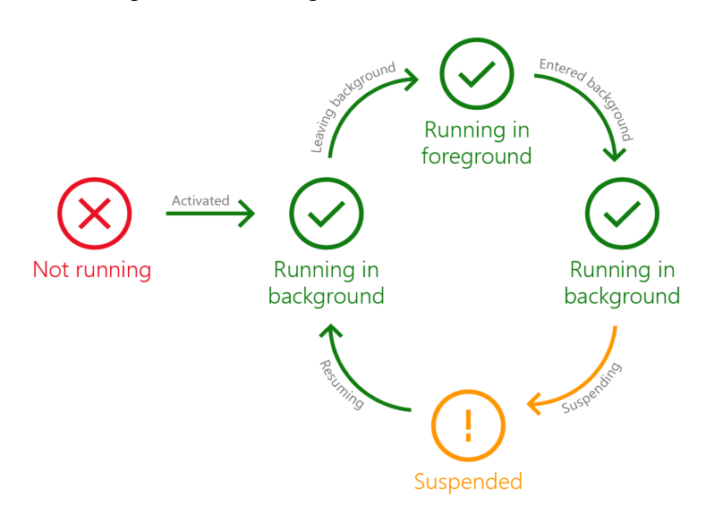
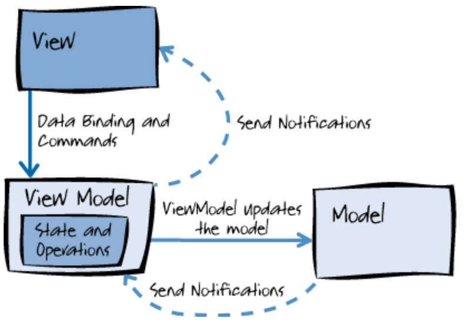
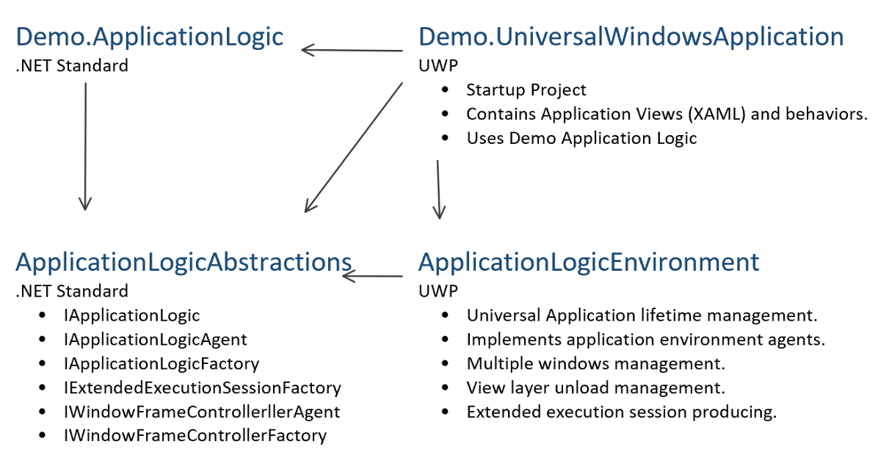
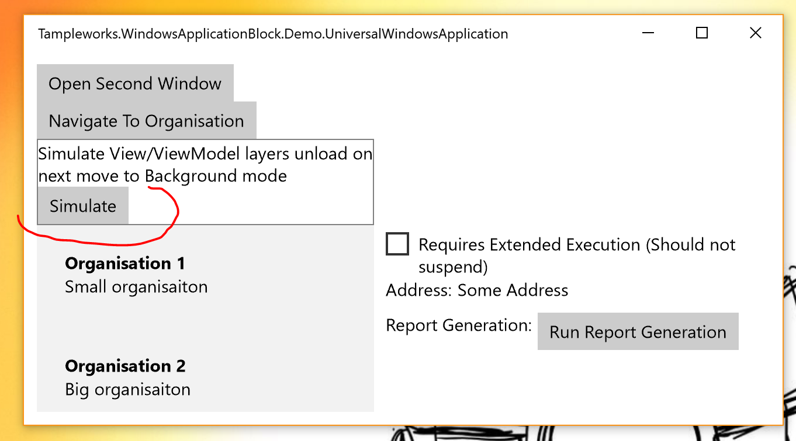

This article was originally published on June 4, 2017. It describes the Universal Windows Platform (UWP) and Windows 10 ecosystem as they existed at that time. The accompanying [source snapshot](./source/README.md) is preserved for historical reference.

The accompanying source contains a demo application that implements advanced UWP lifecycle patterns related to the ["Launching, resuming, and background tasks"](https://docs.microsoft.com/en-us/windows/uwp/launch-resume/index) section of MSDN. The application is organized according to a layered architecture using MVVM, inversion of control, dependency inversion, and dependency injection.
# Universal application architecture considerations
There are several important UWP topics that should be reviewed when making architectural decisions.
## UWP as a mobile-first application platform
Microsoft had an opportunity to build an application platform from scratch to meet the potential requirements of twenty-first-century mobile applications. Developers and other users expected that "Windows 10" would eventually be renamed "Windows" and that users would not have to purchase the next OS version. That might happen when Windows 10's market share reached more than one billion users. Windows 10 S was an example of such a free OS, where users would pay only for Store applications. It was encouraging to see Microsoft willing to pursue such innovations. Each annual Windows 10 release brought continued progress to UWP.

UWP is very different from a classic Windows application. As part of Microsoft's "Mobile First and Cloud First" concept, UWP on Windows 8.x and Windows 10 provides a strong abstraction from the core OS process through its WinRT interfaces. Theoretically, UWP could be ported to other platforms, such as Android, within the next five years.
## Rethinking lifecycle start and stop
UWP differs from other application types primarily in its lifecycle. A classic UWP application exposes start and stop lifecycle events that application code can handle. To understand the UWP lifecycle, you should forget what you know about traditional application lifecycles. In general, UWP has [Not Running, Running, and Suspended states](https://docs.microsoft.com/en-us/windows/uwp/launch-resume/app-lifecycle). Applications may also handle Foreground and Background states.



What inspired Microsoft engineers to design such a [lifecycle](https://docs.microsoft.com/en-us/windows/uwp/launch-resume/app-lifecycle)? I would say that the classic Windows/Unix application lifecycle was inspired by early electrical equipment that could be turned on or off. The UWP lifecycle is more like the lifecycle of thoughts in a creative mind: they may be suspended when a computer does not have enough resources, such as battery power or RAM, and resumed later. When an app is suspended, it should release OS resources such as file handles because the process cannot know whether it will ever be resumed. Windows 10 uses different heuristics to manage the application lifecycle across devices, such as Xbox and desktop computers, and builds, such as Build 10586 and the Anniversary Update, Build 14393. Some Windows 10 versions may freeze and close a process without suspension. Other versions may suspend, hibernate, and reload an application after the computer restarts. A UWP developer should carefully read the ["Launching, resuming, and background tasks"](https://docs.microsoft.com/en-us/windows/uwp/launch-resume/index) section of MSDN and test different form factors and Windows 10 builds.
## Running while minimized with extended execution
[Extended execution](https://docs.microsoft.com/en-us/windows/uwp/launch-resume/run-minimized-with-extended-execution) is related to the application lifecycle, but it is also a significant topic in UWP application architecture. Extended execution is important for application logic that runs for one second or longer. Its basic usage is theoretically simple, but it raises many practical questions:
* Developers want to write logic that is decoupled as much as possible from the extended-execution session mechanism, in accordance with the dependency inversion principle.
* Applications often have multiple processes running in parallel, which may tempt a developer to open two parallel extended-execution sessions. However, UWP allows only one extended-execution session at a time. Attempting to open a second session before disposing of the first raises an `InvalidOperationException`.
* Application logic needs a sufficiently flexible abstraction over a single extended-execution session. It needs a manager that controls the session's lifetime and can host multiple tasks.
* Depending on the Windows device's battery charge, whether energy-saving mode is enabled, ["Battery usage by app"](http://www.howto-connect.com/customize-battery-usage-by-app-in-windows-10/) settings, and other OS factors, an application may call `RequestExtensionAsync()` and receive `ExtendedExecutionResult.Denied`. The absence of extended execution should not prevent the user from starting ordinary long-running work that may be denied or revoked after it starts.
* Every task aggregated under the extended-execution manager should be notified when the shared session is revoked and may handle that event in different ways:
  * Implement task cancellation using `CancellationToken`.
  * Return from the task's incremental long-running loop.
  * Notify the user with a toast notification and continue execution without suspension protection.
* End users should not need to understand the sophisticated UWP lifecycle or the nuances of extended execution. A user may change the ["Battery usage by app"](http://www.howto-connect.com/customize-battery-usage-by-app-in-windows-10/) settings, but that should not change the foreground application experience.

Developers should consider all these aspects if an application may continue working after it is minimized.
## Freeing memory when your app moves to the background
Handling memory pressure is an advanced programming topic described in several good books:
* Jeffrey Richter "Windows via C/C++" [book](https://www.amazon.com/Windows-via-Jeffrey-M-Richter/dp/0735624240/ref=sr_1_1?s=books&ie=UTF8&qid=1496045667&sr=1-1&keywords=windows+via+c%2Fc)
* Joe Duffy "Concurrent Programming on Windows" [book](https://www.amazon.com/Concurrent-Programming-Windows-Joe-Duffy/dp/032143482X/ref=asap_bc?ie=UTF8)
* Kalen Delaney "Microsoft SQL Server 2012 Internals" [book](https://www.amazon.com/Microsoft-Server-Internals-Developer-Reference-ebook/dp/B00JDMQJYC/ref=asap_bc?ie=UTF8)

In a classic Win32 application under memory pressure, you may start receiving `OutOfMemoryException`s. Additionally, a UWP application may be suspended after the [MemoryManager](https://docs.microsoft.com/en-us/uwp/api/Windows.System.MemoryManager).`AppMemoryUsageLimitChanging` event is raised during background execution. SQL Server is an example of an extremely complex application where memory is allocated in blocks, or extents, and managed in a highly advanced way. A much simpler UWP application that attempts to free resources to avoid suspension should handle the following cases:
* According to MSDN guidelines, an app may [unload some data and the View layer](https://docs.microsoft.com/en-us/windows/uwp/launch-resume/reduce-memory-usage) while it is executing in the background.
* Avoid critical work sections in mobile applications where possible. It is natural for a UWP application to be suspended and resumed, and most application tasks should not be harmed by suspension.
* Consider how the application's layered architecture should release consumed RAM.

The idea of unloading the View layer by setting window content to `null` and collecting all related memory was very new. In a UWP application, View-layer memory may be collected without collecting the [Application](https://docs.microsoft.com/en-us/uwp/api/Windows.UI.Xaml.Application) instance.
How realistic is such a situation in a real-world mobile application? At the beginning of 2017, Microsoft released new Surface Pro and Surface Laptop devices with 4 GB of RAM. A student might run a resource-intensive application such as AutoCAD, causing your application's RAM limit to decrease to 250 MB. Another common example is an Xbox running a resource-intensive game that consumes most of the available RAM, leaving your application only 100 MB if it is to remain alive. Does it make sense for your application to stay alive with a minimal amount of RAM? Sometimes it does, such as when you are developing a Skype competitor that must maintain minimal communication with an online server. If your application also requires a large amount of RAM and is not designed to release most of it and restore it when returning to the foreground, it may make sense to let Windows suspend the app and store its RAM on disk.
In any case, an application has several options when the [MemoryManager](https://docs.microsoft.com/en-us/uwp/api/Windows.System.MemoryManager).`AppMemoryUsageLimitChanging` event is raised with arguments warning that the memory limit is changing:
* Ignore the event and expect the application to be suspended or even terminated.
* Free data controlled by the Application Logic that is not required for minimal execution.
* Unload View-layer objects according to the [guidelines](https://docs.microsoft.com/en-us/windows/uwp/launch-resume/reduce-memory-usage).
## MVVM in the UWP context
[MVVM as a pattern](https://msdn.microsoft.com/en-us/library/hh848246.aspx) is very popular in the XAML world.



With UWP on the Windows 10 Anniversary Update (Build 14393), MVVM bindings can be implemented using the new [x:Bind compiled-binding markup extension](https://docs.microsoft.com/en-us/windows/uwp/xaml-platform/x-bind-markup-extension). Compiled bindings improve performance and the debugging experience without changing MVVM principles. Compiled event binding is an important nuance in a layered MVVM architecture. A ViewModel can be a .NET Standard class without using the `System.Windows.Input.ICommand` interface from the `Windows.Foundation.UniversalApiContract` UWP API contract.
## Inversion of control, dependency inversion, and dependency injection
Dependency inversion is one of the fundamental SOLID principles that helps make application development agile. It is useful to understand the differences and relationships among inversion of control, dependency inversion, and dependency injection. To learn more about this topic, I recommend the book "Dependency Injection in .NET" by Mark Seemann. The book contains many nuances and dependency-injection examples for different platforms, including WPF.
# UWP Application Block
This article describes how the Universal Application architectural topics above can be combined in one solution.
## Demo application requirements
The demo application has the following features:
* Application domain logic is built according to inversion-of-control and dependency-injection principles and has no coupling to UWP.
* Ideally, application logic resides in .NET Standard projects.
* The [dependency-injection composition root](http://blog.ploeh.dk/2015/01/06/composition-root-reuse/) should be compatible with .NET Native, which removes type metadata required for reflection. DI containers use reflection to construct dependencies. Therefore, in UWP it is better to use a manual composition-root implementation or register types and namespaces for reflection.
* Application logic is aware of application lifecycle events.
* Application logic can work with an [extended-execution session](https://docs.microsoft.com/en-us/windows/uwp/launch-resume/run-minimized-with-extended-execution).
* Application logic is the long-lived part of the process, unlike the View layer, which [may be unloaded](https://docs.microsoft.com/en-us/windows/uwp/launch-resume/reduce-memory-usage).
* ViewModels support compiled bindings.
* Application logic controls [primary and secondary UWP views (windows)](https://docs.microsoft.com/en-us/windows/uwp/layout/show-multiple-views).
* A ViewModel can control navigation among View frames and pages.
* Logic shared by several UWP applications is extracted into application blocks.
## Solution structure
In this article, the term Application Logic means all application code that is unrelated to the View layer and UWP. We can use several synonyms, such as Business Logic, Core Logic, and Domain Logic. The Application Logic contains the ViewModel infrastructure. In this sample, a ViewModel has no coupling to either UWP packages or the View-layer project.
The solution contains four projects:



The application block contains two reusable projects:
1. `ApplicationLogicAbstractions` - Interfaces used by application logic to control its environment.
1. `ApplicationLogicEnvironment` - Simplifies UWP application initialization and controls application execution starting from an `IApplicationLogicFactory` object.

The solution also contains two demo application projects:
1. `Demo.ApplicationLogic` - Contains the application logic. The Application Logic starts executing from an implementation of the `IApplicationLogicFactory` interface.
1. `Demo.UniversalWindowsApplication` - The UWP application startup project, which contains:
  * XAML and code-behind files.
  * A dependency-injection composition root.
  * A map for finding a XAML page by ViewModel.
# From `IApplicationLogicFactory` to the `IPageViewModelFactory` implementation
* `IApplicationLogicFactory` is the application's starting point used by `ApplicationLogicEnvironment`. It provides `IApplicationLogic`, the root application-logic object, which may be constructed using `IApplicationLogicAgent`. The simplest `IApplicationLogicFactory` can have a default constructor and construct an `IApplicationLogic` instance. In the `Demo.UniversalWindowsApplication` sample project, `ApplicationLogicFactory` is constructed by the dependency-injection composition root and receives additional dependencies such as the `ISemanticLogger` interface.
* `IApplicationLogicAgent` provides control over Application Logic Environment features such as the application lifecycle. `ApplicationLogicAgent` also allows the application to open new UWP views and windows.
* `IApplicationLogic` is the longest-lived application-logic object because it exists until the UWP application terminates. It may therefore store shared state that survives even after the View layer is unloaded. `IApplicationLogic` provides an `IWindowFrameControllerFactory` only for the primary UWP view or window. Application logic may later open secondary windows using `IApplicationLogicAgent.OpenNewSecondaryViewAsync`, as described in the [Show multiple views guide](https://docs.microsoft.com/en-us/windows/uwp/layout/show-multiple-views).
* `IWindowFrameControllerFactory` provides an `IWindowFrameController`, which may be constructed using an `IWindowFrameControllerAgent`.
* `IWindowFrameControllerAgent` manages window content and executes tasks through the View or window thread's [dispatcher](https://docs.microsoft.com/en-us/windows/uwp/api/Windows.UI.Core.CoreDispatcher). The agent may also show View dialogs.
* `IWindowFrameController` is constructed to control window content. It provides an `IPageViewModelFactory` for the initial page of the window. The application block assumes that a UWP window always has a [Frame](https://docs.microsoft.com/en-us/windows/uwp/api/Windows.UI.Xaml.Controls.Frame) as its root visual-tree element and needs a [Page](https://docs.microsoft.com/en-us/windows/uwp/api/Windows.UI.Xaml.Controls.Page) for initial navigation.
* `IPageViewModelFactory` provides a page ViewModel and identifies the view associated with the ViewModel type. This interface is used to navigate a [Frame](https://docs.microsoft.com/en-us/windows/uwp/api/Windows.UI.Xaml.Controls.Frame) to a [Page](https://docs.microsoft.com/en-us/windows/uwp/api/Windows.UI.Xaml.Controls.Page) by calling `Windows.UI.Xaml.Controls.Frame.Navigate(Type sourcePageType, object parameter)`.

The essential relationships among the main abstractions can be described as follows:
1. The DI composition root provides `IApplicationLogicFactory`
1. `IApplicationLogicFactory` + `IApplicationLogicAgent` =>  `IApplicationLogic`
1. `IApplicationLogic.PrimaryWindowFrameControllerFactory` + `IWindowFrameControllerAgent` => `IWindowFrameController`
1. `IWindowFrameController.StartPageViewModelFactory` provides the ViewModel and page-view identifier.
## Using `ApplicationManager` to control application execution
To use this application block, instantiate `ApplicationManager` and call its `ApplicationManager.OnLaunched` method from the `Windows.UI.Xaml.Application.OnLaunched` method. `ApplicationManager` subscribes to events on the `Application` object and controls application execution. Its constructor takes the following arguments:
1. An `IApplicationLogicFactory` implementation used to build the application-logic object.
1. A `Windows.UI.Xaml.Application` instance.
1. A `Func<Guid, Type>` used to find a view type by the view identifier associated with an `IPageViewModelFactory`.
```cs
/// <summary>
/// Invoked when the application is launched normally by the end user.  Other entry points
/// will be used such as when the application is launched to open a specific file.
/// </summary>
/// <param name="e">Details about the launch request and process.</param>
protected override void OnLaunched(LaunchActivatedEventArgs e)
{
    Windows.ApplicationModel.Core.CoreApplication.EnablePrelaunch(true);

    if (applicationManager == null)
    {
        applicationManager = new ApplicationManager(
            () => CompositionRoot.Instance.GetApplicationLogicFactory(),
            this,
            (Guid key) => pageViewMap.Value[key]
        );
    }
    applicationManager.OnLaunched(e);
}
```
`IApplicationLogicFactory` is built by the dependency-injection composition root located in the `CompositionRoot` class.
"The term Inversion of Control (IoC) originally meant any sort of programming style where an overall framework or runtime controlled the program flow." ([Martin Fowler, “InversionOfControl,” 2005](http://martinfowler.com/bliki/InversionOfControl.html))
The `ApplicationManager` class, combined with an `IApplicationLogicFactory` implementation, provides an inversion-of-control mechanism because `ApplicationManager` controls the execution flow of `IApplicationLogic`.
`ApplicationManager` injects the main UWP dependencies into `IApplicationLogicFactory` through agents such as `IApplicationLogicAgent` and `IWindowFrameControllerAgent`. If application logic needs UWP-specific functionality such as the `Windows.System.MemoryManager` class, a developer can create an abstraction for memory information in the `Demo.ApplicationLogic` project, consume it from the application logic, and place its implementation in the `Demo.UniversalWindowsApplication` project.
```cs
public interface IApplicationMemoryManager
{
    ulong AppMemoryUsage { get; }
    event EventHandler<AppMemoryUsageLimitChangingEventArgs> AppMemoryUsageLimitChanging;
}

...

internal sealed class ApplicationMemoryManger : IApplicationMemoryManager
{
    public ApplicationMemoryManger()
    {
        MemoryManager.AppMemoryUsageLimitChanging +=
            (sender, e) => OnAppMemoryUsageLimitChanging(e.NewLimit, e.OldLimit);
    }

    public ulong AppMemoryUsage => MemoryManager.AppMemoryUsage;

    public event EventHandler<ApplicationLogic.AppMemoryUsageLimitChangingEventArgs> AppMemoryUsageLimitChanging;

    private void OnAppMemoryUsageLimitChanging(ulong newLimit, ulong oldLimit) =>
        AppMemoryUsageLimitChanging?.Invoke(
            this,
            new ApplicationLogic.AppMemoryUsageLimitChangingEventArgs(newLimit, oldLimit)
        );
}
```
An `IPageViewModelFactory` implementation resides in the `Demo.ApplicationLogic` project, which does not reference a Page view but must provide a [Guid](https://msdn.microsoft.com/en-us/library/system.guid(v=vs.110).aspx) identifier. The `Demo.UniversalWindowsApplication` project contains the XAML for the [Page](https://docs.microsoft.com/en-us/windows/uwp/api/Windows.UI.Xaml.Controls.Page) view and can provide a type-safe association between the view identifier and View type.
```cs
private static Dictionary<Guid, Type> GetPageViewMap() => new Dictionary<Guid, Type>
{
    {
        ApplicationLogic.MainPage.MainPageViewModelFactory.PageTypeId,
        typeof(MainPage)
    },
    {
        ApplicationLogic.OrganisationCentric.OrganisationCentricViewModelFactory.PageTypeId,
        typeof(OrganisationCentric.OrganisationCentricPageForSecondaryWindow)
    },
    {
        ApplicationLogic.OrganisationCentric.OrganisationCentricPageViewModelFactory.PageTypeId,
        typeof(OrganisationCentric.OrganisationCentricPageForMainWindow)
    },
};
```
Such a map should contain key-value pairs for every `IPageViewModelFactory` that can be used as a navigation target.
## Associating a XAML Page with a ViewModel
The application block handles much of the window and Frame/Page navigation, but a few tasks, such as assigning a ViewModel to a page, must be performed manually in the Page code-behind.
```cs
public sealed partial class MainPage : Page
{
    public MainPage()
    {
        this.InitializeComponent();
    }

    public MainPageViewModel ViewModel { get; private set; }

    protected override void OnNavigatedTo(NavigationEventArgs e)
    {
        base.OnNavigatedTo(e);

        var prameter = (PageNavitedToParameters)e.Parameter;
        ViewModel = (MainPageViewModel)prameter.ViewModel;
    }
}
```
## Lifecycle and extended execution
Application logic can be notified of all application lifecycle events through the following `IApplicationLogicAgent` events: `Suspension`, `Resument`, `EnteredBackground`, and `LeavingBackground`. These events are raised directly from `Windows.UI.Xaml.Application` event handlers.
`IApplicationLogicAgent` provides an `IExtendedExecutionSessionFactory` used to request an extended-execution session. The `ApplicationLogicAbstractions` project contains abstractions that avoid direct coupling to the UWP extended-execution API. However, `IExtendedExecutionSessionFactory` has the same limitation as a UWP application and allows only one extended-execution session at a time. Attempting to open a second session before disposing of the first raises an `InvalidOperationException`. The application-logic layer can nevertheless provide a utility that hosts multiple tasks. Depending on the Windows device's battery charge, whether energy-saving mode is enabled, ["Battery usage by app"](http://www.howto-connect.com/customize-battery-usage-by-app-in-windows-10/) settings, and other OS factors, an application may call `RequestExtensionAsync()` and receive `ExtendedExecutionResult.Denied`. The absence of extended execution should not prevent the user from starting ordinary long-running work that may be denied or revoked after it starts. The `Tampleworks.WindowsApplicationBlock.Demo.ApplicationLogic.ExtendedExecutionTaskAgrigation` class provides this functionality by running tasks under a requested extended-execution session. The demo application contains sample report-generation logic that can be called with a required or optional extended-execution session. Each demo report-generation process can be observed from the ViewModel and View layers, including notifications when the extended-execution session changes or is revoked. See the source code of the `Tampleworks.WindowsApplicationBlock.Demo.ApplicationLogic.ReportGeneration.ReportGenerationAgent` class.
## Simulating memory pressure while your app is in the background
[MSDN documents](https://docs.microsoft.com/en-us/windows/uwp/launch-resume/reduce-memory-usage) how to handle the [MemoryManager.AppMemoryUsageLimitChanging](https://docs.microsoft.com/en-us/uwp/api/Windows.System.MemoryManager) event during background execution. The `Tampleworks.WindowsApplicationBlock.Demo.ApplicationLogic.ApplicationLogic` class uses an injected `IApplicationMemoryManager` to monitor the `AppMemoryUsageLimitChanging` event. Unfortunately, it is difficult to reproduce this event when it is initiated by Windows during background execution. To simulate the process, the demo application's main window has a Simulate button that runs the memory-pressure handling logic ten seconds after the application is minimized.



To release the View layer, the Application Logic calls the `IApplicationLogicAgent.ResetViewAsync` method. The Application Logic can notify all ViewModels about this unload because it provides the ViewModels. The root elements of every window's visual tree are set to `null`. The application logic should then call `GC.Collect` to release managed objects. ViewModels provided by `IPageViewModelFactory` are collected when no references to them remain in `IWindowFrameController`. View content is reconstructed only when the application returns to the foreground. To restore the views, `IWindowFrameController` provides the `IPageViewModelFactory` again. This lifecycle allows new ViewModels to be constructed for open windows or cached at the `IWindowFrameController` level.
## Secondary windows
The `IApplicationLogicAgent` interface has an `OpenNewSecondaryViewAsync` method that opens a secondary window. `OpenNewSecondaryViewAsync` takes an `IWindowFrameControllerFactory` and uses it to build an `IWindowFrameController` for the secondary window. Each window's `IWindowFrameController` has its own `IWindowFrameControllerAgent`, which invokes ViewModel methods through the window's View dispatcher.
