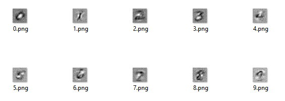
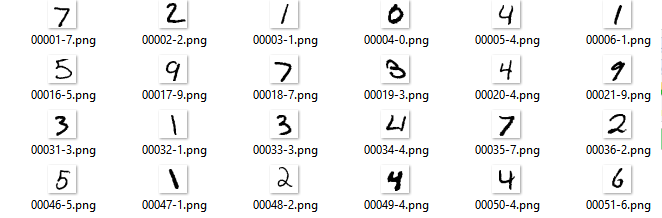

# Make Your Own Neural Network with F#

This article was originally developed as a code project in December 2017 while I was studying Tariq Rashid's book *[Make Your Own Neural Network](https://www.goodreads.com/book/show/29746976-make-your-own-neural-network)*. The book demonstrates the mathematics behind a small neural network through a direct Python implementation. I wanted to understand the same algorithm by translating it into F# and then refactoring it around functions, immutable values, recursive processing, and reusable data pipelines.

The result is not a production machine-learning framework. It is a compact educational implementation that trains a fully connected neural network to recognize handwritten digits from the MNIST dataset. The [historical F# source snapshot](./source/README.md) is stored alongside this article.

The source intentionally retains its 2017 target framework and dependency versions. Those components are out of support and produce current package-security warnings, so the snapshot should be treated as readable historical code rather than deployed software.

## From a Python class to F# functions

The reference Python implementation organizes the input, hidden, and output layers inside a mutable class. [`NeuralNetwork.fs`](./source/NeuralNetwork.fs) separates the algorithm into functions and represents the trained state explicitly as data:

```fsharp
type Model = Matrix<float> list
type DataVector = Vector<float>
```

A model is simply a list of weight matrices. Functions such as `query`, `queryBack`, and `trainSample` receive a model and return a value instead of hiding the weights inside an object.

This representation makes the data flow visible:

```text
input vector
    -> input-to-hidden weight matrix
    -> hidden output vector
    -> hidden-to-output weight matrix
    -> result vector
```

The implementation is still based on the same mathematical operations as the Python version, but the F# code does not require a special neural-network class with a fixed set of fields for individual layers.

## Representing layers as weight matrices

Every connection between two adjacent layers is represented by a matrix. The number of columns is the size of the layer on the left, and the number of rows is the size of the layer on the right.

`randomMatrixList` creates one matrix for every adjacent pair of layer sizes:

```fsharp
let randomMatrixList (layersSizeList : int list) =
    layersSizeList
    |> Seq.pairwise
    |> Seq.map (fun (leftCount, rightCount) ->
        randomMatrix rightCount leftCount)
    |> List.ofSeq
```

For the MNIST network, the model is initialized with the following shape:

```fsharp
randomMatrixList [imageSize.Height * imageSize.Width; 200; countDigit]
```

An MNIST image contains 28 x 28 pixels, so the input layer has 784 values. The hidden layer has 200 nodes, and the output layer has ten nodes representing digits 0 through 9. The resulting model contains two matrices:

```text
200 x 784
10 x 200
```

The initial weights use a normal distribution whose standard deviation depends on the number of inputs:

```fsharp
let randomMatrix outputRowsCount inputColsumnsCount =
    let stdDev = 1.0 / sqrt (float inputColsumnsCount)
    DenseMatrix.init outputRowsCount inputColsumnsCount
        (fun _ _ -> Normal.Sample(0.0, stdDev) |> float)
```

## Forward queries with matrix multiplication and sigmoid activation

Querying the network is a fold over the list of weight matrices:

```fsharp
let logisticVector = Vector.map SpecialFunctions.Logistic

let query (layers : Model) (inputs : DataVector) =
    List.fold
        (fun vector matrix -> matrix * vector |> logisticVector)
        inputs
        layers
```

For each layer, the current vector is multiplied by the next weight matrix. The sigmoid function then converts each result into a value between 0 and 1. That output becomes the input to the next layer.

Using `List.fold` is a useful F# refactoring because the query algorithm no longer needs separate variables such as `hiddenInputs`, `hiddenOutputs`, `finalInputs`, and `finalOutputs`. The same function works for any non-empty list of compatible matrices.

The input pixels are normalized to the range from 0.01 to 0.99:

```fsharp
let normalizeFloat0 = 0.01
let normalizeFloat1 value = value * 0.98 + normalizeFloat0

let byteToNNInput (value : byte) =
    float value / float Byte.MaxValue
    |> normalizeFloat1
```

Avoiding exact zeroes and ones is important because the inverse sigmoid function is used later when the network is queried backward.

## Recursive backpropagation

The most interesting refactoring is `trainSample`. Instead of writing a separate error calculation for a hidden layer and an output layer, the function recursively walks through the list of matrices:

```fsharp
let rec iter previousOutputs weightMatrixList =
    match weightMatrixList with
    | weightMatrix :: sublayers ->
        let nextInputs = weightMatrix * previousOutputs
        let nextOutputs = nextInputs |> logisticVector
        let nextErrors, sublayersUpdated = iter nextOutputs sublayers

        let weightMatrixDelta =
            DenseMatrix.ofColumns [
                nextErrors
                    .PointwiseMultiply(nextOutputs)
                    .PointwiseMultiply(1.0 - nextOutputs)
            ]
            * DenseMatrix.ofRows [previousOutputs]
            * learningRate

        let weightMatrixUpdated = weightMatrix + weightMatrixDelta
        let previousErrors = transpose weightMatrix * nextErrors
        previousErrors, weightMatrixUpdated :: sublayersUpdated

    | [] ->
        let outputErrors = neuralNetworkTartets - previousOutputs
        outputErrors, []
```

The recursive call first calculates the outputs for the layer on the right. When recursion returns, the function has the error vector needed to update the current matrix. It then propagates the error to the previous layer using the transposed matrix.

This makes the implementation structurally independent of a specific number of layers. A model can contain more than one hidden layer as long as the matrix dimensions are compatible. The sample uses one hidden layer because its purpose is to make the algorithm understandable rather than to build a deep-learning framework.

`trainSample` returns a new list of updated matrices:

```fsharp
iter neuralNetworkInputs allLayerWeigthes |> snd
```

The model value changes between training samples, but the individual training operation does not mutate a neural-network object.

## Reading compressed MNIST files lazily

MNIST stores images and labels in separate binary files. [`MnistDatabase.fs`](./source/MnistDatabase.fs) implements the reader. Integers in the headers use network byte order, so `readNetworkInt` converts them before processing:

```fsharp
let readNetworkInt (binaryReader : BinaryReader) =
    binaryReader.ReadInt32()
    |> System.Net.IPAddress.NetworkToHostOrder
```

The image sequence reads one 28 x 28 byte array at a time:

```fsharp
let mnistImagesSeq header stream =
    let binaryReader = new BinaryReader(stream)
    let imageByteSize = header.Size.Height * header.Size.Width

    seq {
        for _ = 1 to header.ImagesCount do
            yield binaryReader.ReadBytes(imageByteSize)
    }
```

`mnistLabeledImageDataExt` opens the image and label files, validates that they contain the same number of records, and returns a lazy sequence created with `Seq.zip`.

The function also records the starting positions of both streams. Each time the sequence is enumerated, it resets the streams and reads the dataset again:

```fsharp
let dataSeq = seq {
    imagesStream.Position <- imageDataStartPosition
    labelsStream.Position <- labelsDataStartPosition

    let imagesSeq = mnistImagesSeq imagesHeader imagesStream
    let labelsSeq = mnistLabelsSeq labelsCount labelsStream

    yield! Seq.zip labelsSeq imagesSeq
}
```

This avoids loading all 60,000 training images into memory and allows the same source sequence to be reused for multiple epochs.

The files are distributed as gzip archives. The historical implementation decompresses each archive into a temporary file so that the resulting stream can seek back to its starting position. The temporary files are deleted through a composed `IDisposable` when training finishes.

## Training epochs as sequence transformations

Training behavior in [`MnistDatabaseNeuralNetwork.fs`](./source/MnistDatabaseNeuralNetwork.fs) is represented by `ChannelDescription`:

```fsharp
type ChannelDescription = {
    PredictItemsCount : int -> int
    Collect : (byte * byte[]) seq -> (byte * byte[]) seq
}
```

A channel transforms the training sequence and predicts how many records it will produce. `trainWithChanels` composes the `Collect` functions before passing the resulting sequence to `Seq.fold`.

An epoch channel repeats the source sequence:

```fsharp
let epochsChanel epochsCount = {
    PredictItemsCount = epochsCount |> (*)
    Collect =
        fun sourceSeq ->
            seq { 1 .. epochsCount }
            |> Seq.collect (fun _ -> sourceSeq)
}
```

The default training configuration uses four epochs:

```fsharp
let learningEpochsDefault = epochsChanel 4
```

Because the MNIST sequence resets its streams whenever it is enumerated, repeating the sequence does not require copying the entire dataset into a collection.

## Image-rotation augmentation

The project also experiments with data augmentation. [`MnistDatabaseExtraction.fs`](./source/MnistDatabaseExtraction.fs) handles image conversion and rotation, while `imageMutationChannel` emits the original image and versions rotated by plus and minus ten degrees:

```fsharp
let defaultRotationAmplitude = 10.0F

let mutationProviders = [
    (fun _ -> id)
    rotateDataImage defaultRotationAmplitude
    rotateDataImage -defaultRotationAmplitude
]
```

The rotations are applied as another sequence transformation:

```fsharp
let imageMutationChannel imageSize = {
    PredictItemsCount = mutationProviders |> List.length |> (*)
    Collect =
        fun sourceSeq ->
            mutationProviders
            |> Seq.collect (fun rotationProvider ->
                let rotation = rotationProvider imageSize
                sourceSeq
                |> Seq.map (fun (label, data) ->
                    label, rotation data))
}
```

The training pipeline combines truncation, image mutation, and epochs:

```fsharp
trainWithChanels
    header
    readFromBegine
    [
        takeFirstChannel 100000
        imageMutationChannel header.Size
        learningEpochsDefault
    ]
    logTrainingProgress
```

This design treats training variations as composable sequence operations rather than placing all preprocessing inside the neural-network algorithm.

## Recognition score

Testing enumerates the 10,000 MNIST test records, queries the trained model, and chooses the output node with the greatest value:

```fsharp
let resultList = query model (vector data)
let resultTop =
    resultList.ToArray()
    |> predictedNumberProbabilitySortedDesc

(int target) = fst resultTop.[0]
```

The score is the number of correct predictions divided by the number of test images:

```fsharp
float scoredCount / float imagesHeader.ImagesCount
```

The December 2017 project reported a recognition score above 97%, with the repository history recording an improvement to approximately 97.2%. This is a historical project result rather than a benchmark reproduced for this archived article. The exact result depends on random initial weights and the selected training pipeline.

The important outcome for me was not competing with specialized machine-learning libraries. It was confirming that the matrix operations, backpropagation, data normalization, and training loop described in the book could be expressed clearly in F#.

## Running the network backward

The network can also be queried in reverse. Given a desired output vector, `queryBack` applies the inverse sigmoid function and multiplies by each transposed weight matrix:

```fsharp
let queryBack (layers : Model) (outputs : DataVector) =
    let queryBackIter rightOutput matrix =
        let rightInput = rightOutput |> logitVector
        let leftOutput =
            transpose matrix * rightInput
            |> scaleVectorToNormaziedFloat1

        leftOutput

    layers
    |> List.rev
    |> List.fold queryBackIter outputs
```

`generateAndSaveNumbersPareidolia` creates a target vector for each digit from 0 through 9, runs the model backward, converts the resulting vector into image bytes, and saves the generated image.



These images are not examples from the MNIST dataset. They visualize the input patterns that the trained network associates with each output digit. They provide an intuitive way to inspect what a small network has learned.

## Extracting the dataset as images

The project can also convert the binary MNIST records into PNG files:



This functionality was useful while developing the binary reader and rotation logic because it made the input data directly inspectable.

## What I would change today

This sample reflects the .NET Core 2.0 and F# ecosystem of 2017. If I modernized it, I would add automated tests independently of the console interface, use deterministic random seeds, add property-based tests for matrix dimensions and normalization, stream decompression without temporary files where practical, and benchmark each training configuration explicitly.

I would still preserve the central ideas:

* represent a model as explicit data;
* express a forward query as a fold;
* use recursion to reveal the structure of backpropagation;
* keep dataset processing lazy;
* model epochs and augmentation as composable transformations; and
* make intermediate results observable through extracted and generated images.

The implementation is intentionally small enough to read from beginning to end. That is its primary value: it turns the mathematical description of a neural network into a concrete F# program without hiding the learning algorithm behind a framework.
